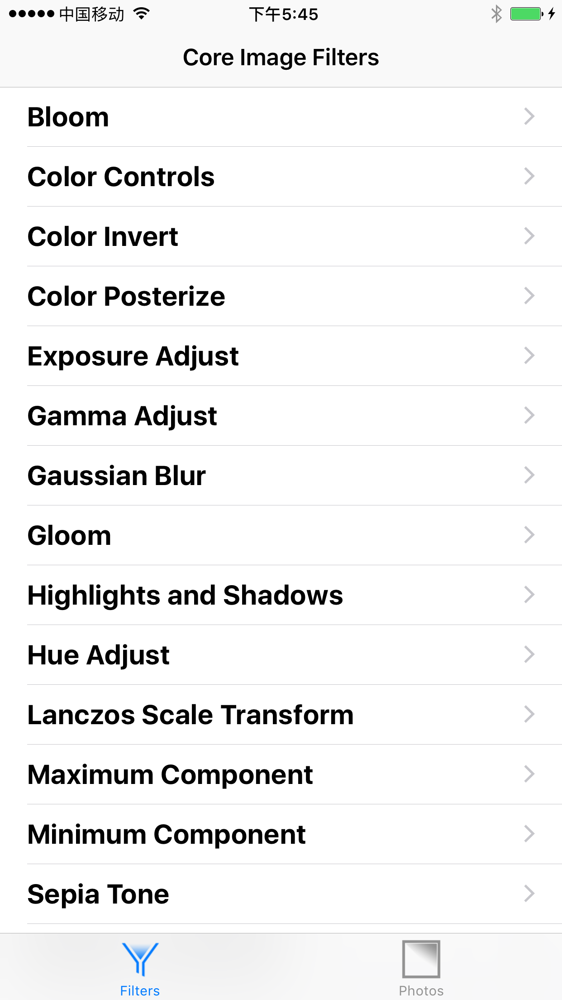
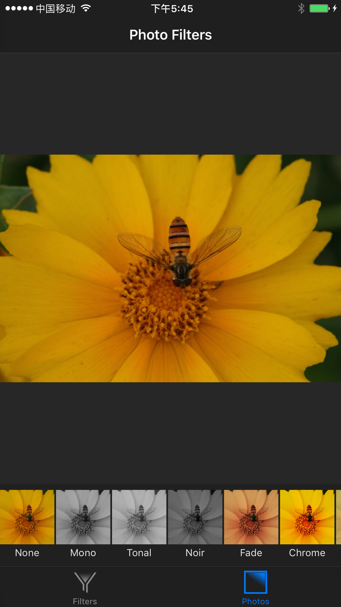
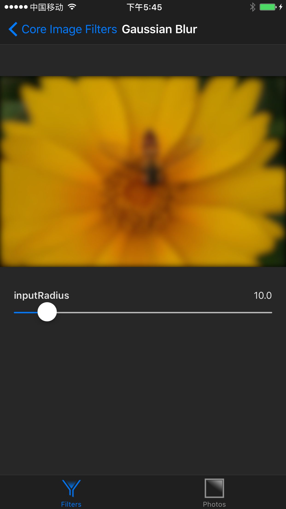

# CIImage
>说明本repository 是对CIImage滤镜的demo
>



>

---
## 基本概念

说到 Core Image，我们首先需要介绍几个基本的概念。

一个滤镜是一个对象，有很多输入和输出，并执行一些变换。例如，模糊滤镜可能需要输入图像和一个模糊半径来产生适当的模糊后的输出图像。

一个滤镜图表是一个链接在一起的滤镜网络 (无回路有向图)，使得一个滤镜的输出可以是另一个滤镜的输入。以这种方式，可以实现精心制作的效果。我们将在下面看到如何连接滤镜来创建一个复古的拍照效果。

## Core Image 架构

`Core Image` 有一个插件架构，这意味着它允许用户编写自定义的滤镜并与系统提供的滤镜集成来扩展其功能。我们在这篇文章中不会用到 Core Image 的可扩展性；我提到它只是因为它影响到了框架的 API。

`Core Image` 是用来最大化利用其所运行之上的硬件的。每个滤镜实际上的实现，即内核，是由一个 GLSL (即 OpenGL 的着色语言) 的子集来书写的。当多个滤镜连接成一个滤镜图表，Core Image 便把内核串在一起来构建一个可在 GPU 上运行的高效程序。

只要有可能，`Core Image` 都会把工作延迟。通常情况下，直到滤镜图表的最后一个滤镜的输出被请求之前都不会发生分配或处理。

为了完成工作，`Core Image` 需要一个称为上下文 (context) 的对象。这个上下文是框架真正工作的地方，它需要分配必要的内存，并编译和运行滤镜内核来执行图像处理。建立一个上下文是非常昂贵的，所以你会经常想创建一个反复使用的上下文。接下来我们将看到如何创建一个上下文。

### 查询可用的滤镜

`Core Image` 滤镜是按名字创建的。要获得系统滤镜的列表，我们要向 `Core Image` 的 kCICategoryBuiltIn 类别请求得到滤镜的名字：
```
let filterNames = CIFilter.filterNamesInCategory(kCICategoryBuiltIn) as [String]
```
iOS 上可用的滤镜列表非常接近于 OS X 上可用滤镜的一个子集。在 OS X 上有 169 个内置滤镜，在 iOS 上有 127 个。

### 通过名字创建一个滤镜

现在，我们有了可用滤镜的列表，我们就可以创建和使用滤镜了。例如，要创建一个高斯模糊滤镜，我们传给 `CIFilter` 初始化方法相应的名称就可以了：
```
let blurFilter = CIFilter(named:"CIGaussianBlur")
```
### 设置滤镜参数

由于 `Core Image` 的插件结构，大多数滤镜属性并不是直接设置的，而是通过键值编码（KVC）设置。例如，要设置模糊滤镜的模糊半径，我们使用 KVC 来设置 `inputRadius` 属性：

```
blurFilter.setValue(10.0 forKey:"inputRadius")
```
由于这种方法需要 `AnyObject?` （即 Objective-C 里的 id）作为其参数值，它不是类型安全的。因此，设置滤镜参数需要谨慎一些，确保你传值的类型是正确的。

### 查询滤镜属性

为了知道一个滤镜提供什么样的输入和输出参数，我们就可以分别获取 inputKeys 和 outputKeys 数组。它们都返回 `NSString `的数组。

要获取每个参数的详细信息，我们可以看看由滤镜提供的 attributes 字典。每个输入和输出参数名映射到它自己的字典里，描述了它是什么样的参数，如果有的话还会给出它的最大值和最小值。例如，下面是 CIColorControls 滤镜对应的 inputBrightness 参数字典：

```
inputBrightness = {
    CIAttributeClass = NSNumber;
    CIAttributeDefault = 0;
    CIAttributeIdentity = 0;
    CIAttributeMin = -1;
    CIAttributeSliderMax = 1;
    CIAttributeSliderMin = -1;
    CIAttributeType = CIAttributeTypeScalar;
};
```

对于数值参数，该字典会包含 `kCIAttributeSliderMin` 和 `kCIAttributeSliderMax` 键，来限制期望的输入域。大多数参数还包含一个 `kCIAttributeDefault` 关键字，映射到该参数的默认值。

